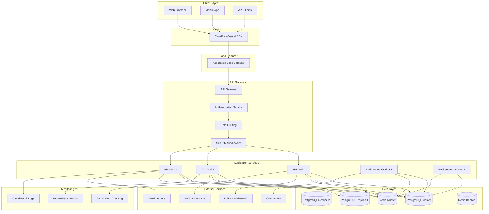
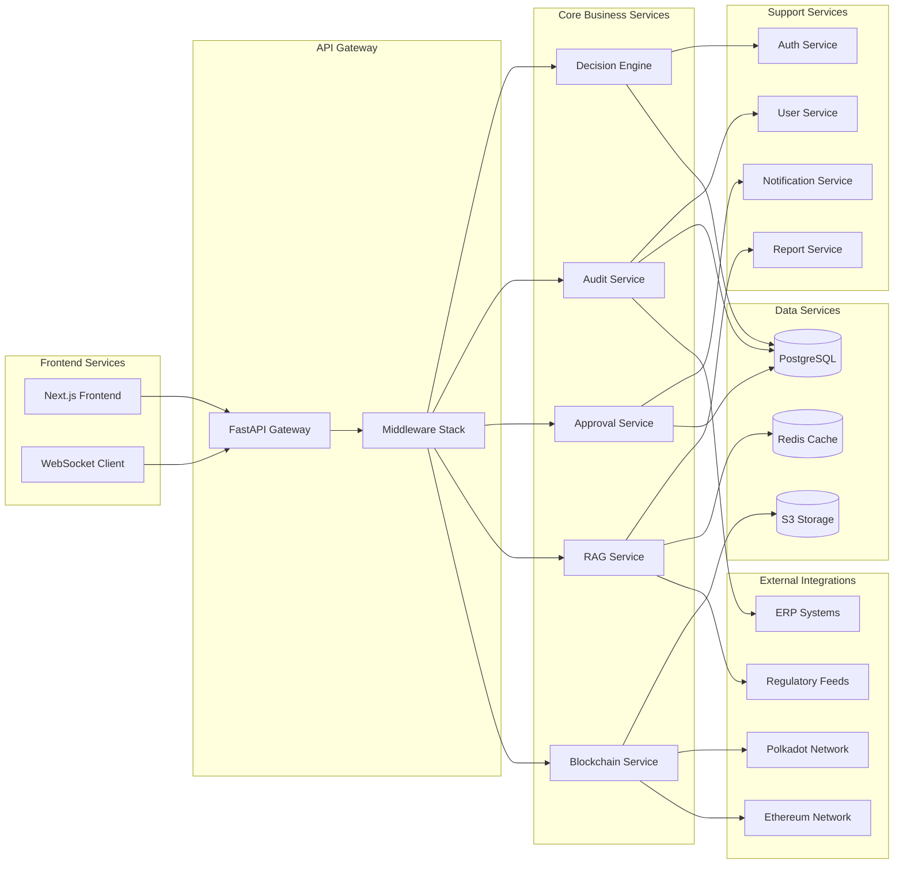
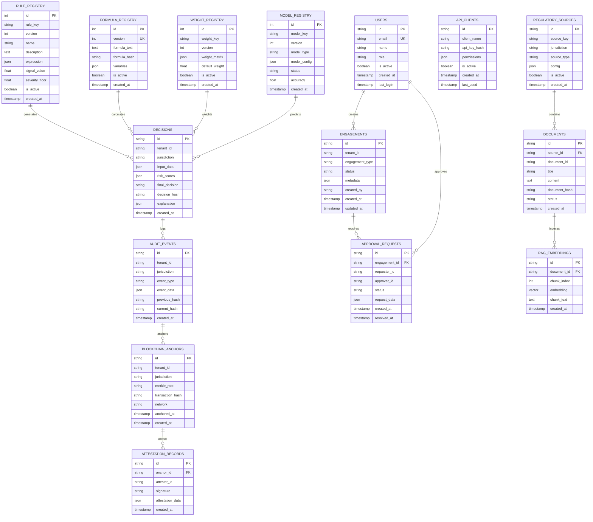
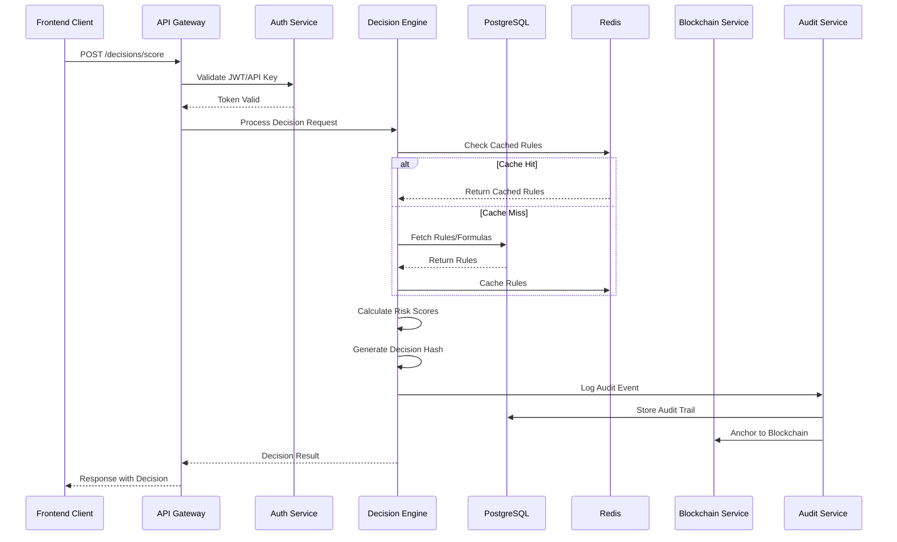
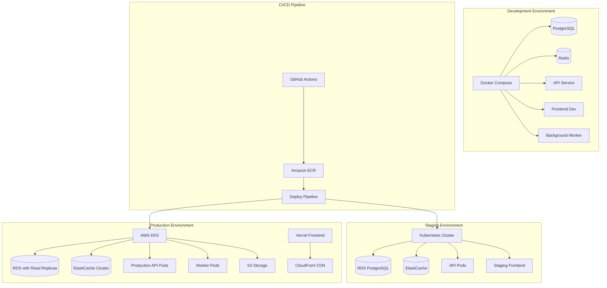
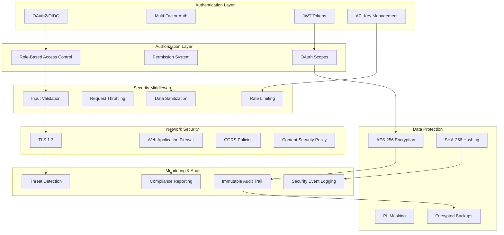
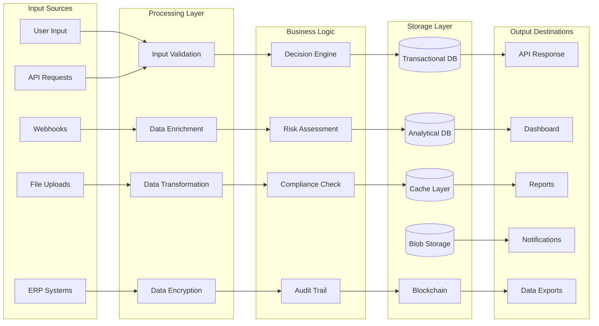
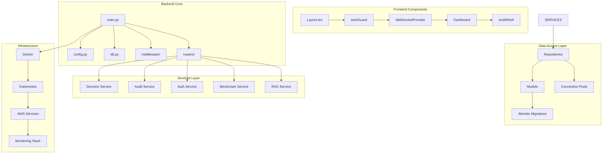
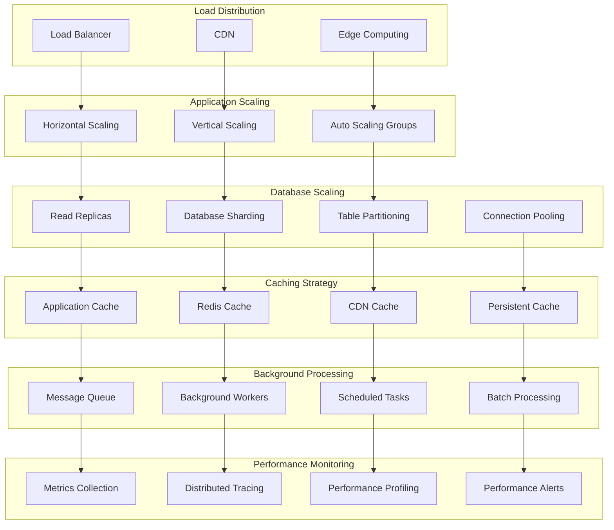
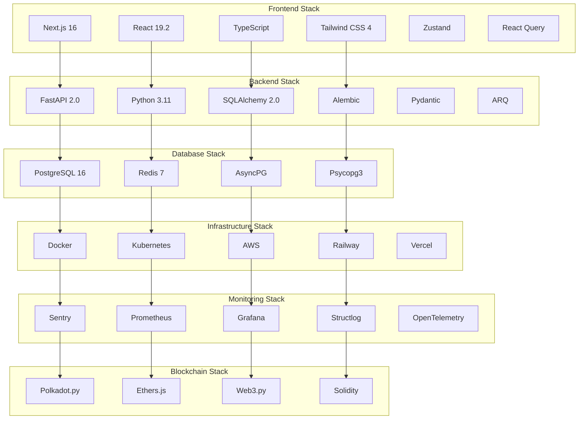

# Arkashri Architecture Graphs

## 1. High-Level System Architecture

## 2. Microservices Architecture Flow

## 3. Database Schema Architecture

## 4. Service Communication Flow

## 5. Deployment Architecture

## 6. Security Architecture

## 7. Data Flow Architecture

## 8. Component Dependency Graph

## 9. Performance & Scaling Architecture

## 10. Technology Stack Graph

These graphs provide a comprehensive visual representation of the Arkashri architecture, covering all major aspects from high-level system design to detailed component relationships and technology stack choices.
