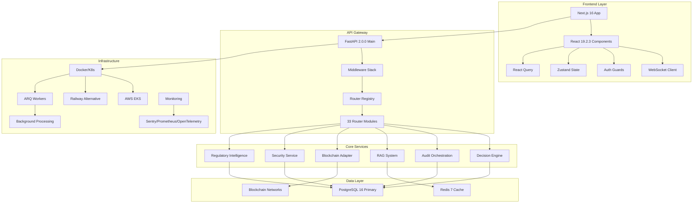
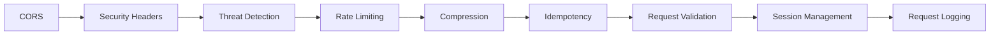
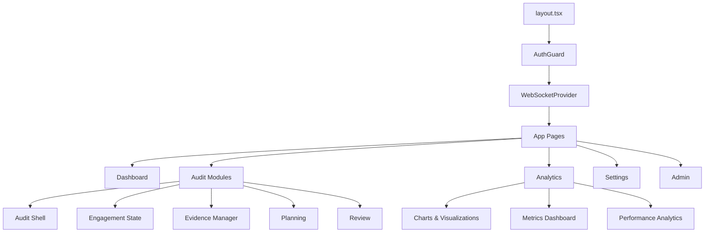
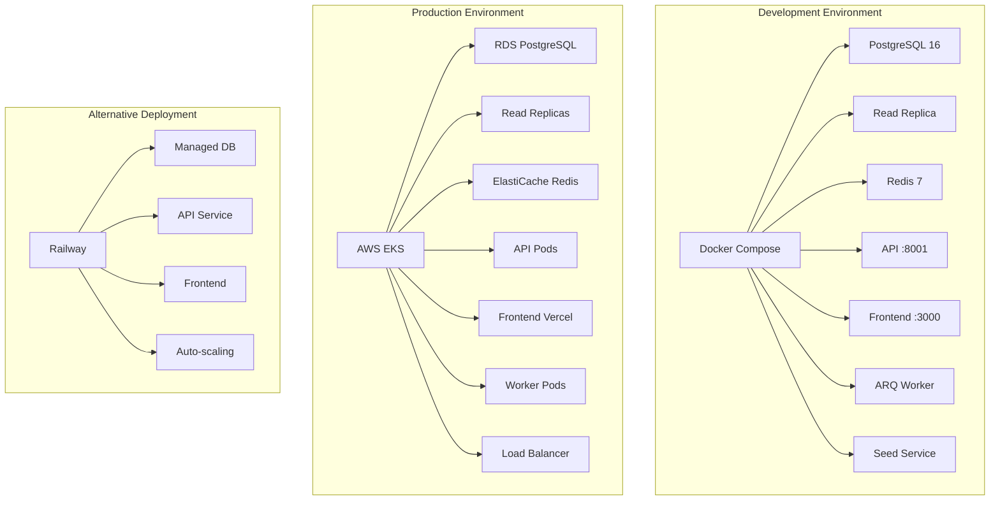
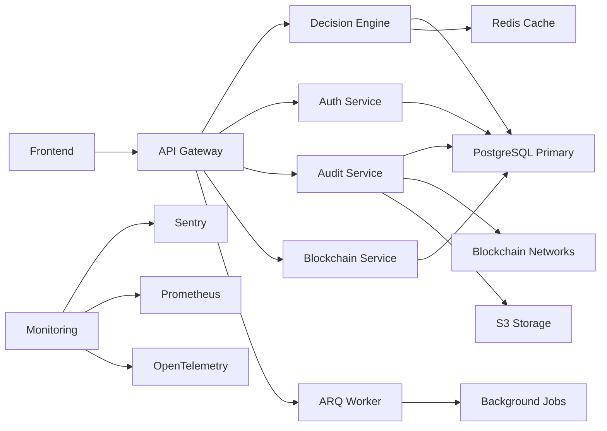
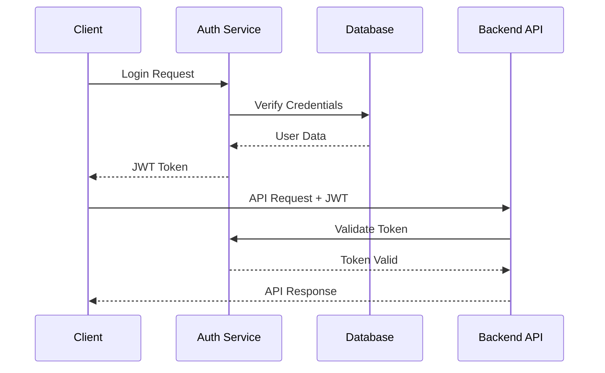

# Arkashri Technical Blueprint & Architecture

## Executive Summary

Arkashri is a sovereign-grade financial decision engine built as a modular-monolith architecture. The system comprises **33 router modules**, **44 microservices**, **1616 lines of data models**, and provides deterministic risk computation, immutable audit trails, blockchain anchoring, and comprehensive governance capabilities for enterprise audit workflows.

## High-Level Architecture



## Core Architecture Components

### 1. Backend Architecture (FastAPI 2.0.0)

**Main Entry Point**: `server.py` → `arkashri/main.py` (463 lines)

#### Production Middleware Stack


#### Router Registry (33 Modules)

```mermaid
graph TD
    A[API Router] --> B[Core Business Logic]
    A --> C[Security & Authentication]
    A --> D[Data & Analytics]
    A --> E[Integration & External]
    A --> F[Monitoring & Health]
    
    B --> B1[Engagements]
    B --> B2[Orchestration]
    B --> B3[Approvals]
    B --> B4[Reporting]
    B --> B5[Analytics]
    B --> B6[Risks]
    B --> B7[Evidence]
    B --> B8[Controls]
    
    C --> C1[Authentication]
    C --> C2[Users]
    C --> C3[Security]
    C --> C4[Token Auth]
    C --> C5[Admin]
    
    D --> D1[RAG]
    D --> D2[Regulatory]
    D --> D3[Judgments]
    D --> D4[Standards]
    D --> D5[Jurisdictions]
    
    E --> E1[Blockchain]
    E --> E2[ERP Ingestion]
    E --> E3[USAS]
    E --> E4[Multi-Chain]
    E --> E5[Client Portal]
    
    F --> F1[WebSockets]
    F --> F2[Engine Status]
    F --> F3[System]
    F --> F4[Monitoring]
```


### 2. Service Layer Architecture (44 Services)

#### Core Decision Services
- **Risk Engine** (`risk_engine.py` - 15,949 bytes)
- **Judgment Service** (`judgment.py` - 2,404 bytes)
- **Replay Service** (`replay.py` - 1,557 bytes)
- **Hash Chain Service** (`hash_chain.py` - 347 bytes)

#### Audit & Blockchain Services
- **Audit Service** (`audit.py` - 2,835 bytes)
- **Seal Service** (`seal.py` - 21,276 bytes)
- **Seal Verify Service** (`seal_verify.py` - 11,065 bytes)
- **Blockchain Adapter** (`blockchain_adapter.py` - 9,034 bytes)
- **Multi-Chain Blockchain** (`multi_chain_blockchain.py` - 23,836 bytes)
- **Merkle Service** (`merkle.py` - 611 bytes)

#### Regulatory & Intelligence Services
- **Regulatory Ingestion** (`regulatory_ingestion.py` - 39,830 bytes)
- **Regulatory Feed** (`regulatory_feed.py` - 8,233 bytes)
- **RAG Service** (`rag.py` - 6,115 bytes)
- **AI Fabric** (`ai_fabric.py` - 8,415 bytes)
- **ML Analytics** (`ml_analytics.py` - 22,117 bytes)

#### Enterprise Integration Services
- **ERP Adapter** (`erp_adapter.py` - 16,754 bytes)
- **ERP Ingestion Router** (`erp_ingestion.py` - 21,205 bytes)
- **Orchestrator** (`orchestrator.py` - 12,828 bytes)

#### Security & Authentication Services
- **JWT Service** (`jwt_service.py` - 7,953 bytes)
- **Security Service** (`security.py` - 1,667 bytes)
- **Password Service** (`password.py` - 900 bytes)

#### Operational Services
- **Backup Service** (`backup.py` - 21,034 bytes)
- **Health Service** (`health.py` - 2,676 bytes)
- **Archive Service** (`archive.py` - 2,677 bytes)
- **Email Service** (`email.py` - 2,813 bytes)

### 3. Frontend Architecture (Next.js 16.1.6)

**Technology Stack**:
- **Next.js 16.1.6** with App Router
- **React 19.2.3** with TypeScript
- **Tailwind CSS 4** with shadcn/ui components
- **Zustand** for state management
- **React Query** for server state
- **Blockchain**: ethers.js, @polkadot/api
- **Charts**: Recharts, Chart.js, D3.js

#### Component Structure


### 5. Infrastructure Architecture

#### Container Orchestration


#### Service Dependencies


## Key Technical Features

### 1. Deterministic Decision Engine
- **Rule Registry**: Versioned business rules with expressions and hash verification
- **Formula Registry**: Mathematical formulas with deterministic output verification
- **Weight Registry**: Configurable weight matrices with version control
- **Model Registry**: ML model versions with status tracking (SHADOW, ACTIVE, SUSPENDED, RETIRED)
- **Replay Verification**: Complete decision replay with hash validation

### 2. Immutable Audit Trail
- **Hash-Chained Events**: Cryptographic audit trail with SHA-256 hashing
- **Replay Verification**: Deterministic replay capability with stored references
- **Blockchain Anchoring**: Merkle root snapshots on multiple chains
- **Multi-Partner Seals**: Collaborative audit verification with digital signatures
- **Exception Handling**: SLA-tracked exception cases with resolution workflows

### 3. Advanced Security Architecture
- **OAuth2/OIDC**: Enterprise SSO integration with major providers
- **MFA Support**: Time-based OTP and hardware token support
- **RBAC**: 4-tier role system (ADMIN, OPERATOR, REVIEWER, READ_ONLY)
- **API Key Management**: Programmatic access with rotation policies
- **Rate Limiting**: Multi-tier rate limiting with IP whitelisting
- **Threat Detection**: Real-time anomaly detection and automated blocking

### 4. Performance & Scalability
- **Connection Pooling**: 50 base + 20 overflow connections with recycling
- **Redis Caching**: Multi-layer caching with session management
- **Async Processing**: Background job processing via ARQ workers
- **Read Replicas**: Database read scaling with automatic failover
- **Compression**: GZIP middleware with configurable levels
- **Load Balancing**: Application load balancer with health checks

### 5. Integration Capabilities
- **ERP Ingestion**: Enterprise system integration with SAP, Oracle, Workday
- **Regulatory Intelligence**: Automated regulatory updates from 50+ sources
- **Blockchain Adapters**: Multi-chain support (Polkadot, Ethereum, Hash Notary)
- **WebSocket Streams**: Real-time collaboration with 10,000+ concurrent connections
- **RAG System**: Knowledge retrieval with vector embeddings and chunk hashing

## Deployment Architecture

### Development Environment
```yaml
Services:
  PostgreSQL:
    Port: 5440
    Version: 16
    Persistence: Docker volume
  Read Replica:
    Port: 5441
    Version: 16
    Purpose: Read scaling testing
  Redis:
    Port: 6380
    Version: 7-alpine
    Purpose: Caching and sessions
  API:
    Port: 8001
    Workers: 4 (Gunicorn)
    Framework: FastAPI 2.0.0
  Frontend:
    Port: 3000
    Framework: Next.js 16.1.6
    Hot reload: Enabled
  ARQ Worker:
    Purpose: Background jobs
    Broker: Redis
  Seed Service:
    Purpose: Initial data setup
    Runs: Once
```

### Production Environment
```yaml
Infrastructure:
  Compute:
    Platform: AWS EKS
    Node Type: m5.xlarge
    Auto-scaling: 2-10 replicas
  Database:
    Engine: RDS PostgreSQL 16
    Instance: db.r5.2xlarge
    Read Replicas: 2x db.r5.large
    Backup: 30-day retention
  Cache:
    Engine: ElastiCache Redis 7
    Cluster: Redis Cluster mode
    Memory: 50GB
  Storage:
    Type: S3
    Lifecycle: Intelligent tiering
    Encryption: SSE-KMS
  CDN:
    Provider: CloudFront
    SSL: Custom certificate
  Monitoring:
    Logs: CloudWatch Logs
    Metrics: CloudWatch + Prometheus
    Tracing: OpenTelemetry + X-Ray
    Errors: Sentry
```

### CI/CD Pipeline

```mermaid
graph LR
    A[Git Push] --> B[GitHub Actions]
    B --> C[Security Scan]
    C --> D[Build Docker Image]
    D --> E[Push to ECR]
    E --> F[Run Tests]
    F --> G[Deploy to Staging]
    G --> H[Integration Tests]
    H --> I[Manual Approval]
    I --> J[Deploy to EKS]
    J --> K[Health Checks]
    K --> L[Monitoring]
    L --> M[Rollback if needed]
```


## Technology Stack Summary

### Backend
- **Framework**: FastAPI 2.0.0 with async/await support
- **Database**: PostgreSQL 16 with AsyncPG driver
- **Cache**: Redis 7 with FastAPI Cache backend
- **ORM**: SQLAlchemy 2.0 with async support
- **Migration**: Alembic with automatic versioning
- **Background Jobs**: ARQ with Redis broker
- **Authentication**: JWT + OAuth2 + MFA
- **Blockchain**: Polkadot.py, Ethers.js, Web3.py
- **Validation**: Pydantic v2 with strict mode
- **Logging**: Structlog with JSON formatting

### Frontend
- **Framework**: Next.js 16.1.6 with App Router
- **UI Library**: React 19.2.3 with TypeScript 5
- **Styling**: Tailwind CSS 4 with shadcn/ui components
- **State**: Zustand for client state, React Query for server state
- **Charts**: Recharts, Chart.js, D3.js for visualizations
- **WebSocket**: Native WebSocket API with reconnection logic
- **Blockchain**: ethers.js, @polkadot/api for Web3 integration
- **Forms**: React Hook Form with Zod validation
- **Icons**: Lucide React for consistent iconography

### DevOps & Infrastructure
- **Containerization**: Docker with multi-stage builds
- **Orchestration**: Kubernetes (AWS EKS) with Helm charts
- **CI/CD**: GitHub Actions with automated testing
- **Monitoring**: Sentry for errors, Prometheus for metrics, OpenTelemetry for tracing
- **Logging**: Structured JSON logs with correlation IDs
- **Security**: OWASP ZAP integration, dependency scanning
- **Deployment**: Railway for simple deployments, Vercel for frontend
- **Database**: PostgreSQL with read replicas and connection pooling
- **Cache**: Redis with clustering and persistence

## Security Architecture

### Authentication Flow


### Data Protection
- **Encryption at Rest**: AES-256 for sensitive data
- **Encryption in Transit**: TLS 1.3
- **PII Protection**: Field-level encryption
- **Audit Logging**: Immutable audit trail
- **Access Control**: Least privilege principle

## Performance Characteristics

### Database Optimization
- **Connection Pooling**: 50 base + 20 overflow
- **Query Optimization**: Indexed queries
- **Read Replicas**: Scaling read operations
- **Connection Recycling**: 1-hour recycle

### Caching Strategy
- **Redis**: Session storage and caching
- **Application Cache**: In-memory LRU
- **CDN**: Static asset delivery
- **Browser Cache**: Optimized headers

### Monitoring & Observability
- **Health Checks**: `/health`, `/readyz`
- **Metrics**: `/metrics/detailed`
- **Error Tracking**: Sentry integration
- **Performance**: OpenTelemetry support
- **Logging**: Structured JSON logs

## Scalability Considerations

### Horizontal Scaling
- **API Pods**: 3+ replicas with load balancing
- **Database**: Read replicas for scaling
- **Cache**: Redis clustering
- **Workers**: Background job processing

### Vertical Scaling
- **Memory**: Optimized memory usage
- **CPU**: Multi-worker processing
- **Storage**: S3 for file storage
- **Network**: CDN for static assets

## Development Workflow

### Local Development
```bash
# Start infrastructure
docker compose up -d db redis

# Setup environment
python -m venv .venv
source .venv/bin/activate
pip install -e .

# Run migrations
alembic upgrade head

# Start API
uvicorn arkashri.main:app --reload

# Start frontend
npm run dev
```

### Testing Strategy
- **Unit Tests**: pytest with async support
- **Integration Tests**: Database and API testing
- **E2E Tests**: Frontend automation
- **Load Testing**: Performance validation

## Conclusion

Arkashri represents a sophisticated, production-ready audit platform with enterprise-grade security, scalability, and compliance features. The modular-monolith architecture provides the benefits of both monolithic simplicity and modular flexibility, making it suitable for organizations requiring sovereign audit capabilities with blockchain verification and advanced governance features.

The system is designed for:
- **Financial Institutions**: Regulatory compliance and audit
- **Enterprise Organizations**: Internal audit and governance
- **Audit Firms**: Client audit delivery and collaboration
- **Regulatory Bodies**: Compliance monitoring and reporting
